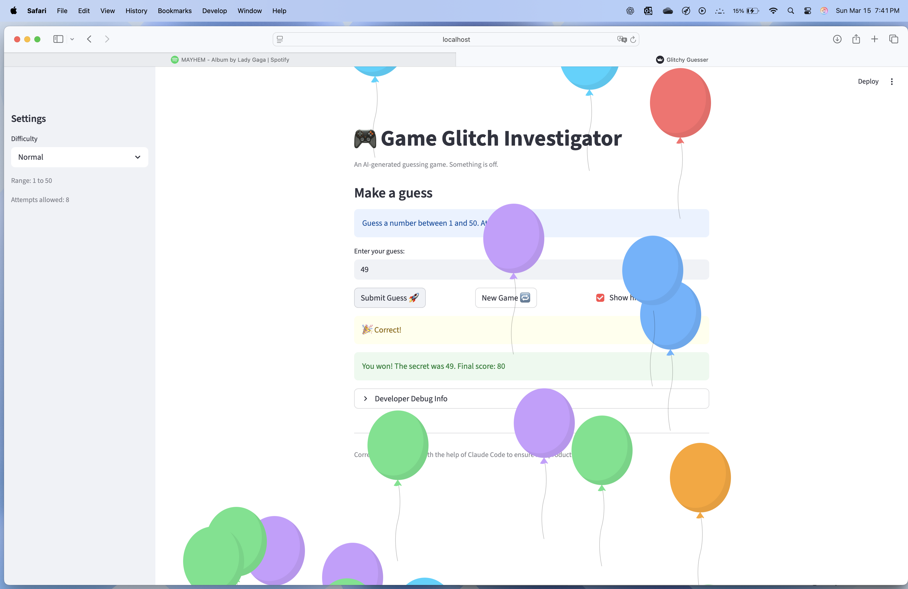

# 🎮 Game Glitch Investigator: The Impossible Guesser

## 🚨 The Situation

You asked an AI to build a simple "Number Guessing Game" using Streamlit.
It wrote the code, ran away, and now the game is unplayable. 

- You can't win.
- The hints lie to you.
- The secret number seems to have commitment issues.

## 🛠️ Setup

1. Install dependencies: `pip install -r requirements.txt`
2. Run the broken app: `python -m streamlit run app.py`

## 🕵️‍♂️ Your Mission

1. **Play the game.** Open the "Developer Debug Info" tab in the app to see the secret number. Try to win.
2. **Find the State Bug.** Why does the secret number change every time you click "Submit"? Ask ChatGPT: *"How do I keep a variable from resetting in Streamlit when I click a button?"*
3. **Fix the Logic.** The hints ("Higher/Lower") are wrong. Fix them.
4. **Refactor & Test.** - Move the logic into `logic_utils.py`.
   - Run `pytest` in your terminal.
   - Keep fixing until all tests pass!

## 📝 Document Your Experience

- [X] Describe the game's purpose.

A number guessing game built with Streamlit where the player tries to guess a secret number within a limited number of attempts. The game gives hints after each guess and tracks your score across attempts. It was intentionally shipped with 13+ bugs to find and fix.

- [X] Detail which bugs you found.

13 bugs were identified, including:
- Inverted Higher/Lower hints
- No out-of-range validation
- Broken New Game reset
- Wrong difficulty ranges
- Attempts counter starting at 1
- Hardcoded range in the UI
- Normal and Hard difficulty ranges swapped
- Delayed history display
- Difficulty change not resetting the game
- Negative attempt counts when switching difficulty mid-game
- Scoring rewarding wrong guesses on even attempts
- Empty string inputs not being rejected

- [X] Explain what fixes you applied.

The Core logic was refactored from app.py into logic_utils.py. Fixes included:
- Correcting the hint messages in check_guess
- Adding range validation to parse_guess
- Fully resetting game state on New Game and difficulty ranges
- Initializing attempts to 0
- Using dynamic ranges in the UI
- Moving the debug panel after the submit block
- Adding duplicate guess detection
- Fixing the scoring penalty logic

## 📸 Demo

